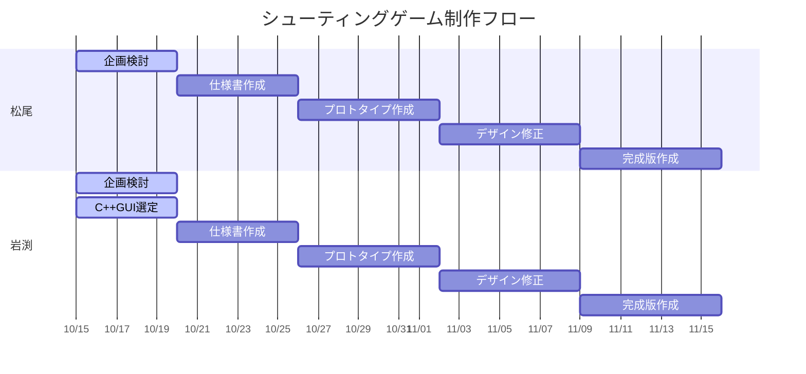

# プロジェクト-シューティング

- [予定](#予定)

## ゲーム制作フロー
1. 企画・検討
・パワーポイント5枚程度でゲームの説明

2. 仕様書作成
・機能仕様
・非機能仕様
・デザイン
・クラス図
・世界観仕様

3. プロトタイプ作成
・最低限仕様を満たすゲームのプログラム

4. デザイン修正
・プロトタイプの内容を元に足りない部分を列挙

5. 完成版作成
・遊べるゲームを目指してプログラム

6. デバッグ
・バグチェック等、デバッグを通じて修正

7. 完成(終了)
・必要に応じてルールブックの作成

## 検討GUI
* Qt: Javaで言うSwingみたいなGUIライブラリ、フレームワーク。C++だけで作ることができる。
* JS + WASM: WebAssemblyによりC++コードをWeb上で実行できるようになる。描画はJavaScriptが担当する。
* openGLが良いと思う
多分非Unix環境ではQtとWASMはインストールが難しそう。WSLがWindowsに入りそうなら良いんだけど

## ブックマーク
**各種図はdiagrams.mdに移行しました。[ここ](/diagrams.md)**
[https://onlinegdb.com/kGYo98t65](スラッシュ変換プログラム)

[C++GUI](https://teratail.com/questions/165307)
[ゲーム企画書各種図解説](https://note.com/ukyousan/n/neea2e631702b#uD9c6)
サンプル3を参考に 各画面の説明
サンプル1が画面遷移図
データフローダイアグラム

##カード設計
必要なカードの種類をリストアップ、及び合計枚数をカウント
合計枚数：
カードの種類(浮かぶなら各種類でのカード枚数、強化情報等も)
自機
・スピード変更:デフォルト(10)
・サイズ変更:デフォルト(10)
弾
・弾速:デフォルト(20)
・反射回数:デフォルト(1回)
・方向(3way-2way):デフォルト(1way)
→角度
・サイズ:デフォルト(10)
・連射速度:デフォルト(4/sec)
・ダメージ増加:デフォルト(10)