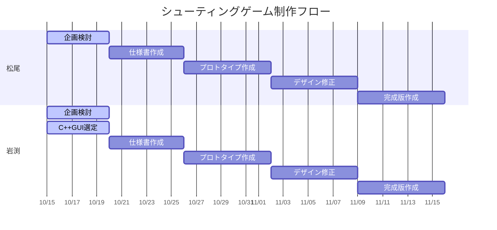
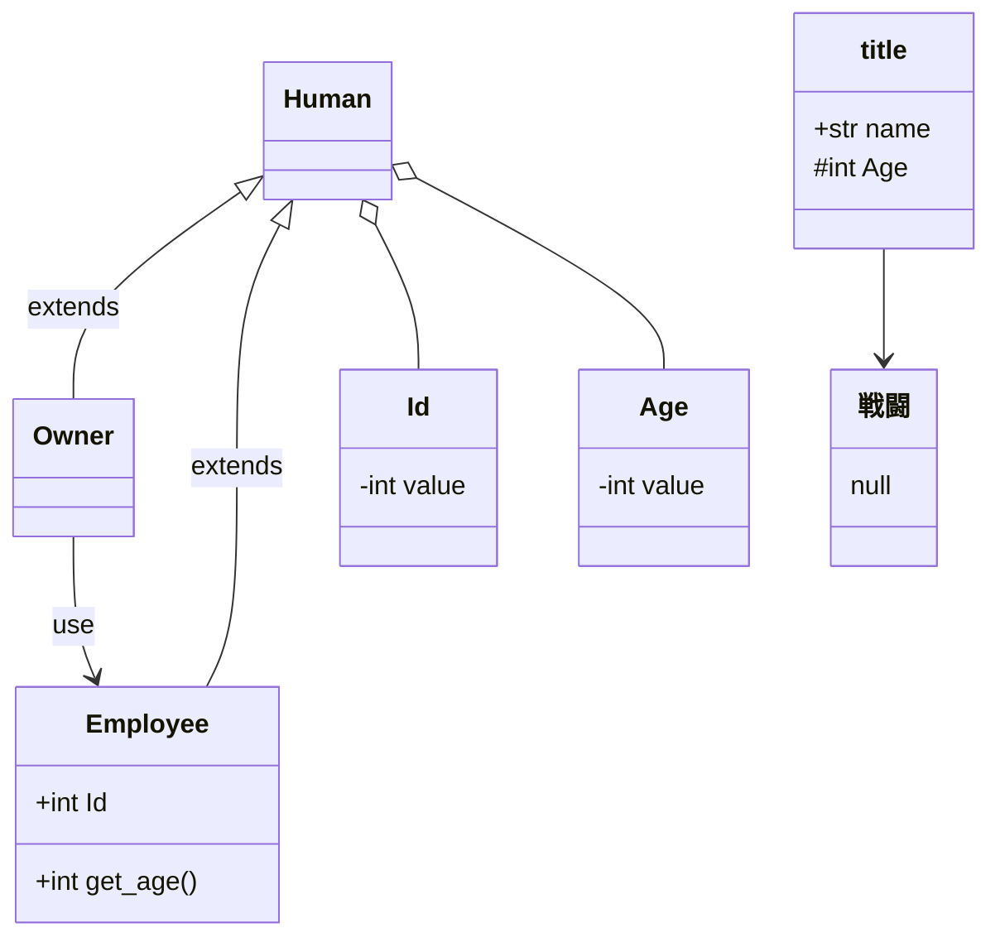
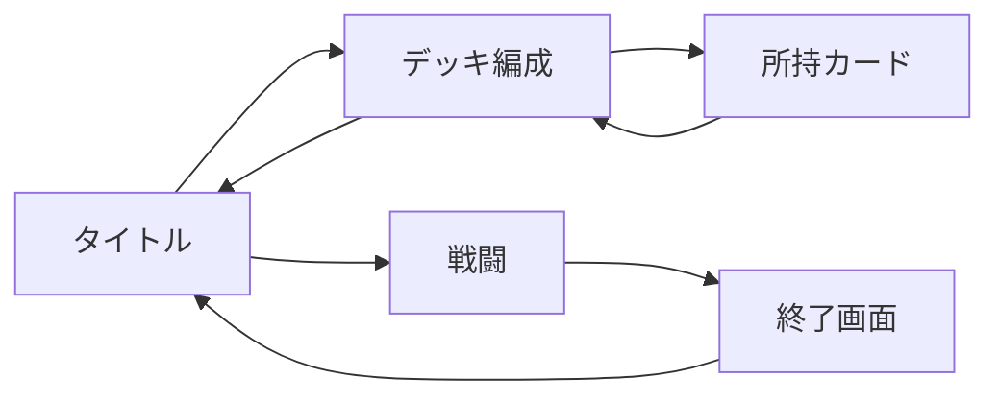

# プロジェクト-シューティング

- [予定](#予定)

## ゲーム制作フロー
1. 企画・検討
・パワーポイント5枚程度でゲームの説明

2. 仕様書作成
・機能仕様
・非機能仕様
・デザイン
・クラス図
・世界観仕様

3. プロトタイプ作成
・最低限仕様を満たすゲームのプログラム

4. デザイン修正
・プロトタイプの内容を元に足りない部分を列挙

5. 完成版作成
・遊べるゲームを目指してプログラム

6. デバッグ
・バグチェック等、デバッグを通じて修正

7. 完成(終了)
・必要に応じてルールブックの作成

## 検討GUI
* Qt: Javaで言うSwingみたいなGUIライブラリ、フレームワーク。C++だけで作ることができる。
* JS + WASM: WebAssemblyによりC++コードをWeb上で実行できるようになる。描画はJavaScriptが担当する。
* openGLが良いと思う
多分非Unix環境ではQtとWASMはインストールが難しそう。WSLがWindowsに入りそうなら良いんだけど

https://onlinegdb.com/kGYo98t65

https://note.com/ukyousan/n/neea2e631702b#uD9c6
サンプル3を参考に 各画面の説明

サンプル1が画面遷移図
データフローダイアグラム

## 画面遷移図

所持カードはウィンドウ