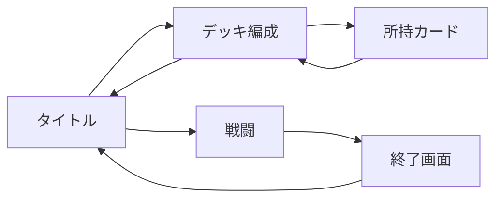
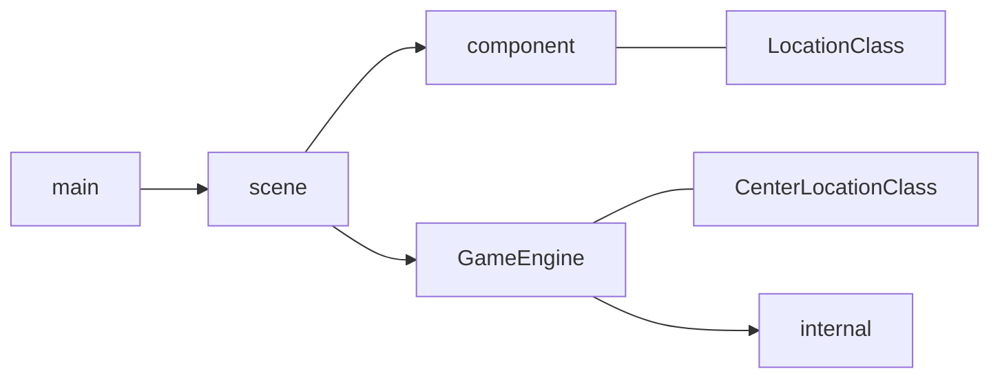
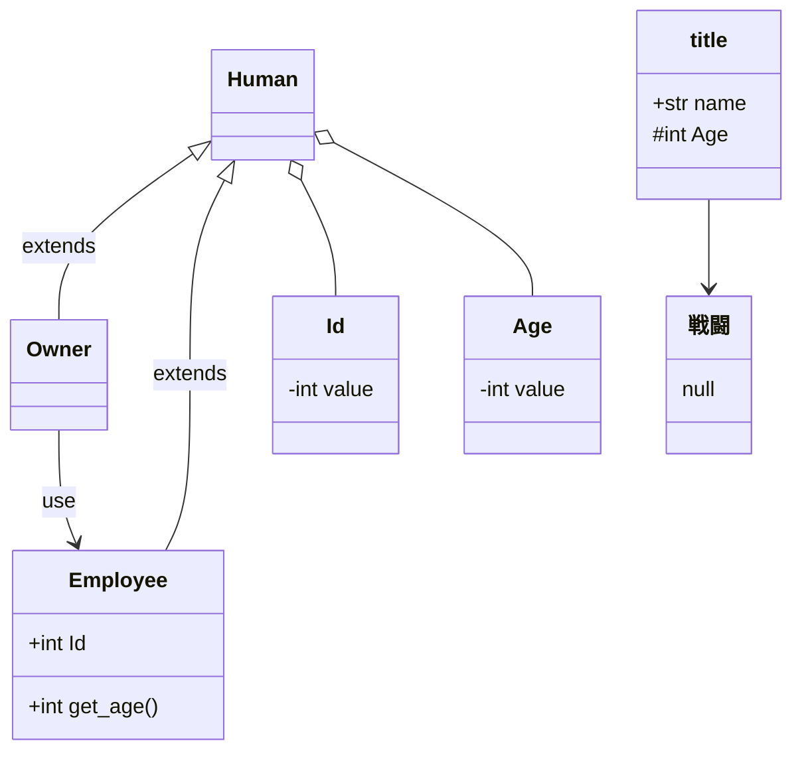
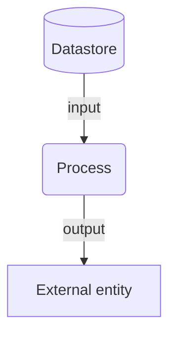

## 画面遷移図

```mermaid
graph LR;
    タイトル-->デッキ編成
    デッキ編成-->タイトル
    デッキ編成-->所持カード
    所持カード-->デッキ編成
    タイトル-->戦闘
    戦闘-->終了画面
    終了画面-->タイトル
```
所持カードはウィンドウ
それ以外は上書き

## ライブラリ関係

```mermaid
graph LR;
    main-->scene
    scene-->component  
    component---LocationClass
    scene-->GameEngine
    GameEngine---CenterLocationClass
    GameEngine-->internal
```
Locationは描画の時やりやすいのでViewにおいて使う。一方GameObjectの計算をするときには中心座標などがほしいのでCenterLocationを用いる。

## クラス図

```mermaid
classDiagram
  class title {
    +str name
    #int Age
  }

  class Id { -int value }
  class Age { -int value }
  class Owner
  class Employee {
    +int Id

    +int get_age()
  }
title--> 戦闘
class 戦闘{
    null
}


  Human <|-- Owner : extends
  Human <|-- Employee : extends
  Human o-- Id
  Human o-- Age
  Owner --> Employee : use
```

```mermaid
graph TD
  external[External entity]
  process(Process)
  datastore[(Datastore)]

  datastore -- input --> process -- output --> external

```